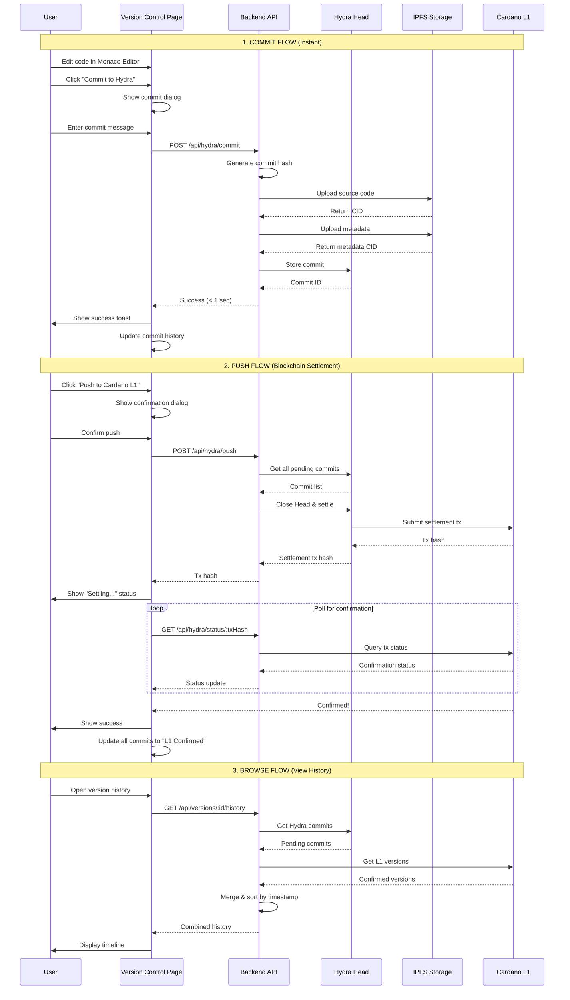
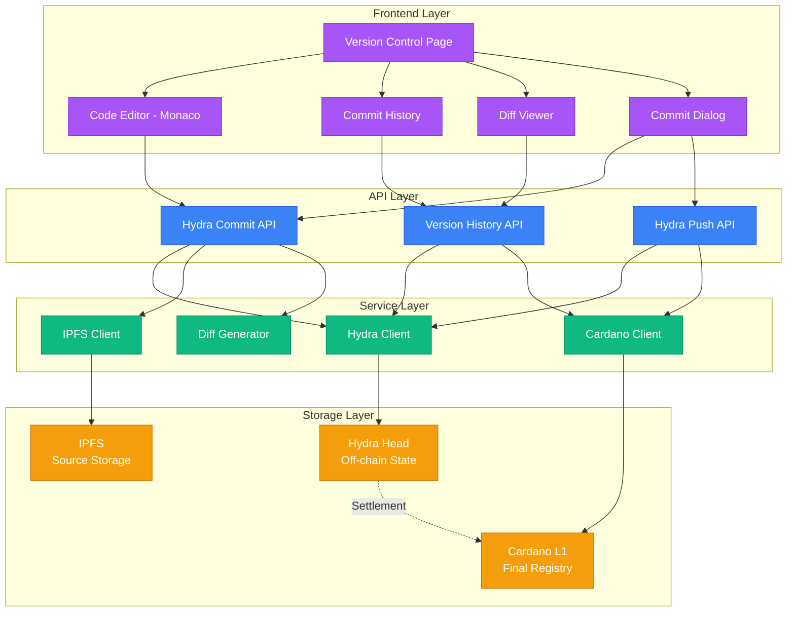
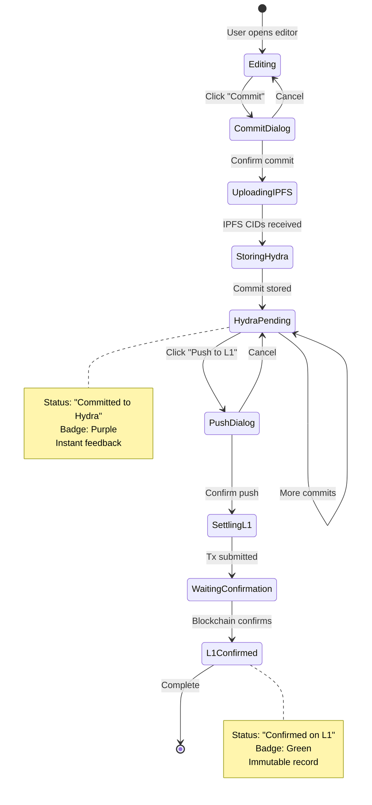

# Hydra Version Control - Architecture Reference

## System Flow Diagram



## Component Architecture



## Data Flow: Commit to L1



## File Structure

```
d:\downloadds\AxoHub-BCH\
│
├── app/
│   ├── version-history/
│   │   └── page.tsx                    # ✏️ MODIFY - Main version control page
│   │
│   └── api/
│       └── hydra/
│           ├── commit/
│           │   └── route.ts            # 🆕 CREATE - Commit to Hydra
│           ├── push/
│           │   └── route.ts            # 🆕 CREATE - Push to L1
│           ├── commits/
│           │   └── [packageId]/
│           │       └── route.ts        # 🆕 CREATE - Get commits
│           └── status/
│               └── [txHash]/
│                   └── route.ts        # 🆕 CREATE - Check L1 status
│
├── components/
│   ├── code-editor.tsx                 # 🆕 CREATE - Monaco editor
│   ├── commit-dialog.tsx               # 🆕 CREATE - Commit message dialog
│   ├── commit-history.tsx              # 🆕 CREATE - Timeline view
│   ├── diff-viewer.tsx                 # 🆕 CREATE - Code diff display
│   └── hydra-status-indicator.tsx      # 🆕 CREATE - Head status badge
│
├── lib/
│   ├── hydra/
│   │   ├── client.ts                   # 🆕 CREATE - Hydra Head client
│   │   ├── storage.ts                  # 🆕 CREATE - Commit storage
│   │   └── diff.ts                     # 🆕 CREATE - Diff utilities
│   │
│   └── cardano/
│       ├── types.ts                    # ✏️ MODIFY - Add Hydra types
│       ├── query.ts                    # ✏️ MODIFY - Add Hydra queries
│       └── batch-publish.ts            # 🆕 CREATE - Batch L1 publish
│
└── types/
    └── version-control.ts              # 🆕 CREATE - Version control types
```

## Key Technologies

| Technology | Purpose | Why? |
|------------|---------|------|
| **Hydra Head** | Off-chain commits | Instant feedback, no blockchain wait |
| **Monaco Editor** | Code editing | Same editor as VS Code, familiar UX |
| **IPFS (Pinata)** | Source storage | Decentralized, immutable storage |
| **Cardano L1** | Final registry | Immutable, permanent record |
| **react-diff-view** | Diff display | GitHub-like diff visualization |
| **Framer Motion** | Animations | Smooth transitions, better UX |

## State Management

```typescript
// Version Control Page State
interface VersionControlState {
  // Editor state
  currentCode: string
  originalCode: string
  hasChanges: boolean
  language: 'plutus' | 'aiken' | 'solidity'
  
  // Hydra state
  hydraHeadStatus: 'open' | 'closed' | 'settling'
  pendingCommits: HydraCommit[]
  
  // L1 state
  confirmedVersions: L1Version[]
  
  // UI state
  isCommitDialogOpen: boolean
  isPushDialogOpen: boolean
  selectedCommitForDiff?: string
  
  // Loading states
  isCommitting: boolean
  isPushing: boolean
  isLoadingHistory: boolean
}
```

## API Response Types

```typescript
// POST /api/hydra/commit
interface CommitResponse {
  success: boolean
  commitId: string
  commitHash: string
  sourceCID: string
  metadataCID: string
  status: 'hydra_pending'
  timestamp: number
}

// POST /api/hydra/push
interface PushResponse {
  success: boolean
  txHash: string
  commitIds: string[]
  commitCount: number
  status: 'settling'
  estimatedConfirmationTime: number // seconds
}

// GET /api/versions/:id/history
interface VersionHistoryResponse {
  packageId: string
  packageName: string
  hydraCommits: HydraCommit[]
  l1Versions: L1Version[]
  combined: VersionHistoryItem[] // Merged & sorted
  hydraHeadStatus: 'open' | 'closed'
}
```

## Environment Variables

```bash
# Hydra Configuration
HYDRA_NODE_URL=http://localhost:4001
HYDRA_API_KEY=your_hydra_api_key
HYDRA_HEAD_TIMEOUT=3600  # 1 hour

# IPFS Configuration
NEXT_PUBLIC_PINATA_API_KEY=your_pinata_key
NEXT_PUBLIC_PINATA_SECRET_KEY=your_pinata_secret

# Cardano Configuration
NEXT_PUBLIC_BLOCKFROST_API_KEY=your_blockfrost_key
NEXT_PUBLIC_CARDANO_NETWORK=preprod

# Feature Flags
ENABLE_HYDRA_VERSION_CONTROL=true
MAX_HYDRA_COMMITS_BEFORE_PUSH=50
```

## Performance Targets

| Operation | Target | Current | Status |
|-----------|--------|---------|--------|
| Commit to Hydra | < 1s | TBD | 🟡 Pending |
| Push to L1 | < 30s | TBD | 🟡 Pending |
| Load editor | < 2s | TBD | 🟡 Pending |
| Generate diff | < 500ms | TBD | 🟡 Pending |
| Query history | < 1s | TBD | 🟡 Pending |

## Security Checklist

- [ ] Validate wallet ownership before commit
- [ ] Verify wallet signature on L1 push
- [ ] Sanitize commit messages (XSS prevention)
- [ ] Validate source code size limits
- [ ] Rate limit commit API (prevent spam)
- [ ] Encrypt Hydra Head communication
- [ ] Verify IPFS CID integrity
- [ ] Prevent unauthorized Head closure

## Monitoring & Alerts

```typescript
// Metrics to track
const metrics = {
  hydra: {
    headUptime: 'percentage',
    commitLatency: 'milliseconds',
    settlementSuccessRate: 'percentage',
    activeHeads: 'count'
  },
  
  api: {
    commitEndpointLatency: 'milliseconds',
    pushEndpointLatency: 'milliseconds',
    errorRate: 'percentage'
  },
  
  user: {
    commitsPerDay: 'count',
    pushesPerDay: 'count',
    averageCommitsBeforePush: 'count'
  }
}
```

## Rollback Plan

If Hydra integration fails:

1. **Immediate:** Disable Hydra feature flag
2. **Fallback:** Direct L1 publishing (existing flow)
3. **Data:** Export Hydra commits to IPFS
4. **Notify:** Alert users of temporary downtime
5. **Debug:** Check Hydra node logs
6. **Restore:** Re-enable after fix confirmed

---

## Quick Reference Commands

```bash
# Start Hydra node (local development)
hydra-node --testnet-magic 1 --node-socket /path/to/node.socket

# Check Hydra Head status
curl http://localhost:4001/heads

# Monitor Hydra logs
tail -f ~/.hydra/logs/hydra-node.log

# Test commit API
curl -X POST http://localhost:3000/api/hydra/commit \
  -H "Content-Type: application/json" \
  -d '{"packageId":"test","version":"1.0.1","sourceCode":"...","message":"Test commit"}'
```

---

**Status:** Architecture design complete ✅  
**Next:** Begin implementation Phase 1
